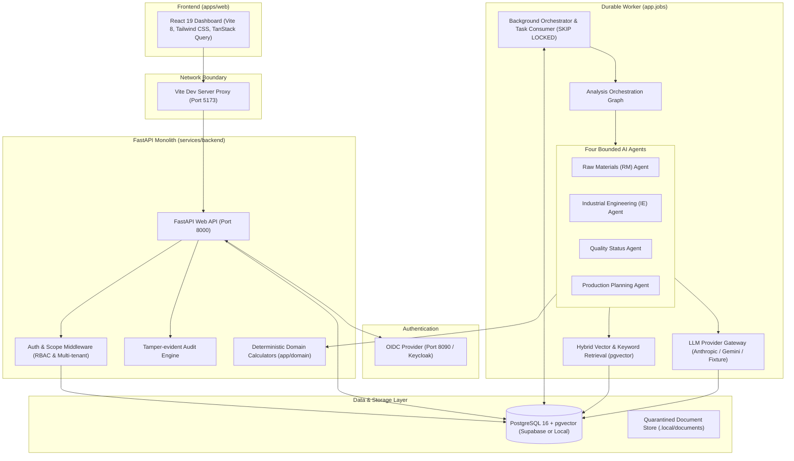

# LineSense AI — Comprehensive Project Architecture & Technical Guide

---

## 1. Executive Summary & Core Mission

**LineSense AI** is a multi-agent factory operations decision-support system built for apparel manufacturing. In garment manufacturing, a production supervisor or line planner faces a recurring critical challenge:
> *"Can this purchase order finish on time, what is blocking it across materials, machinery, or quality, what evidence supports that, and what exact steps should we take next?"*

In traditional factories, answering this requires checking 4 to 5 disparate spreadsheets and siloed ERP/MES modules. LineSense AI unifies this into a single cohesive platform powered by **four bounded AI agents**, **deterministic business calculation engines**, and a **human-in-the-loop approval workflow**.

---

## 2. Core Architectural Principles & Invariants

1. **The LLM Never Establishes Business Truth:**
   Large Language Models (LLMs) hallucinate numbers and cannot be trusted with inventory balances or capacity calculations. In LineSense AI, **all business metrics** (stock balances, shortage quantities, cycle times, bottleneck operations, line efficiency, and quality defect rates) are computed 100% deterministically by pure Python functions in `services/backend/app/domain/`.
2. **The LLM Never Authorizes a Database Write:**
   AI agents have read-only tools over an immutable snapshot of the order. They can recommend or rank actions (e.g. allocating capacity, suggesting material replenishment, recommending an IE review), but **only a human supervisor can approve and trigger transactional execution**.
3. **Bounded Agent Execution:**
   Each agent is strictly constrained:
   - Maximum 4 investigative tool calls per task.
   - At most 1 self-repair turn if output validation fails.
   - Per-run token and call budget (capped at 12 model calls total across the whole run).
   - 120-second hard execution deadline.
   - Automatic graceful degradation: If an LLM provider is down or throttled, the system falls back to pure deterministic analysis with a clear badge (`AI explanation unavailable`), never crashing or blocking factory operations.

---

## 3. High-Level System Architecture



---

## 4. Repository & Folder Structure

```
linesense/
├── apps/
│   └── web/                                # Frontend React application
│       ├── src/
│       │   ├── api/                        # Typed client generated from OpenAPI
│       │   ├── components/                 # Reusable UI components & layouts
│       │   ├── hooks/                      # TanStack Query & custom hooks
│       │   ├── pages/                      # Dashboard, Orders, Analysis, Approvals, Quality
│       │   └── test/                       # Vitest component test suites
│       ├── package.json                    # React 19, Vite 8, Tailwind CSS v4
│       └── vite.config.ts                  # Vite server & security proxy configuration
│
├── contracts/                              # Shared schema contracts & specifications
│   ├── openapi.json                        # Auto-exported OpenAPI schema for frontend code-gen
│   └── protocol/                           # Versioned JSON schemas for agent messages (v1.0)
│
├── data/                                   # Synthetic seed datasets (factories, styles, BOMs)
│   └── corpus/                             # 30+ apparel factory SOPs and QA policy documents
│
├── docs/                                   # Deep architectural, security, and operations documentation
│   ├── architecture/                       # C4 models, ERD, agent protocols, state machines
│   ├── adr/                                # Architectural Decision Records (ADRs 0001-0008)
│   └── operations/                         # Deployment, backup/restore, metrics runbooks
│
├── infra/                                  # Production deployment assets
│   ├── compose/                            # Docker Compose definitions (API, Worker, DB, Caddy)
│   └── identity/                           # Keycloak realm configs and dev IdP
│
├── scripts/                                # Maintenance, backup, validation, and dev-db bash scripts
│
└── services/
    └── backend/                            # Core Python modular monolith
        ├── app/
        │   ├── agents/                     # The 4 bounded AI agent implementations
        │   │   ├── base.py                 # Abstract agent loop, tool budget, repair turns
        │   │   ├── planning/               # Production capacity planning agent
        │   │   ├── rm/                     # Raw materials & inventory balance agent
        │   │   ├── ie/                     # Industrial engineering & cycle-time agent
        │   │   ├── quality/                # Quality inspection & shipment hold agent
        │   │   └── prompts/                # Markdown system prompts with strict schemas
        │   │
        │   ├── api/                        # FastAPI routers & HTTP controllers
        │   │   ├── routers/                # /orders, /analysis, /approvals, /quality, /documents
        │   │   ├── middleware.py           # CSRF, security headers, request tracing
        │   │   └── deps.py                 # Dependency injection (Auth session, DB session)
        │   │
        │   ├── audit/                      # Tamper-evident audit logging for every decision
        │   ├── auth/                       # OIDC token validation, session management, RBAC
        │   ├── db/                         # SQLAlchemy models (50 tables) and session lifecycle
        │   ├── domain/                     # Pure, deterministic business logic & calculations
        │   │   ├── inventory/              # Gross demand, shortage calculations, coverage days
        │   │   ├── capacity/               # Line availability, slot allocations
        │   │   ├── ie/                     # Cycle times, line balancing, throughput
        │   │   ├── quality/                # Defect rates, DHU, shipment eligibility rules
        │   │   └── approvals/              # 4-eyes approval workflow & transactional commit
        │   │
        │   ├── jobs/                       # Durable worker runtime & job queue (PostgreSQL backed)
        │   ├── llm/                        # Multi-provider LLM gateway (Anthropic, Gemini, Fixture)
        │   ├── nlp/                        # Document parsing (PDF/TXT), chunking, cleaning
        │   ├── orchestration/              # Analysis workflow graph, state transitions, snapshots
        │   ├── retrieval/                  # pgvector vector search & embedding generation
        │   └── seed/                       # Deterministic synthetic data generator
        │
        ├── devtools/                       # Local lightweight OIDC server (dev_oidc)
        ├── migrations/                     # Alembic schema migrations
        └── pyproject.toml                  # Python dependencies managed via uv
```

---

## 5. The Four Bounded AI Agents

Each agent operates on a **frozen snapshot** of the order data (guaranteeing reproducible evaluation and isolation).

| Agent | Responsibility | Deterministic Domain Calculations | Tools Exposed to Agent | Output Actions & Proposals |
|---|---|---|---|---|
| **Raw Materials (`rm`)** | Checks if all fabrics, trims, and thread exist to satisfy the Bill of Materials (BOM) before the target cut date. | Shortage units, coverable units, lead time projections, reorder points. | `get_material_position`<br>`get_expected_receipts`<br>`get_consumption_history`<br>`get_bom_demand` | `REPLENISHMENT_SUGGESTION`<br>`RESERVATION` (Proposal for approval) |
| **Industrial Engineering (`ie`)** | Analyzes whether sewing lines can achieve target Standard Allowed Minutes (SAM) and flags bottlenecks. | Operation cycle times, line balance index, units/hour capacity. | `get_line_analysis`<br>`get_operation_statistics`<br>`compare_observed_vs_standard` | `IE_REVIEW` (Method/staffing review suggestion) |
| **Quality (`quality`)** | Inspects defect rates, AQL thresholds, active quarantine holds, and shipment release eligibility. | Defective rate, Defects per Hundred Units (DHU), shipment eligibility gates. | `get_inspections`<br>`get_policy_rules`<br>`get_defect_breakdown` | `QUALITY_HOLD_REVIEW`<br>Release recommendations |
| **Production Planning (`planning`)** | Solves the slot-allocation puzzle to schedule order completion before the delivery deadline. | Earliest slot scheduling algorithm, line capability matching. | `get_dependency_findings`<br>`list_compatible_lines`<br>`get_remaining_capacity`<br>`simulate_allocation` | `ALLOCATION` (Proposed line assignment for supervisor approval) |

---

## 6. How LLMs are Integrated & Safety Controls

### 6.1 Supported Providers
The LLM gateway (`app/llm/`) abstracts model providers behind a unified protocol:
1. **Google Gemini (`gemini`)**: Integrated via direct REST communication using `httpx` (e.g. `gemini-2.5-flash`), supporting Google AI Studio API keys.
2. **Anthropic Claude (`anthropic`)**: Integrated via the official `anthropic` SDK (e.g. `claude-opus-5` or `claude-3-7-sonnet`).
3. **Fixture Double (`fixture`)**: A deterministic, offline test double that reproduces realistic tool-calling conversations without internet or API keys.
4. **Disabled (`disabled`)**: Disables AI inference entirely; returns pure deterministic findings.

### 6.2 Prompt Defense & Data Redaction
- **Prompt Injection Defense**: Tool results and uploaded document contents are wrapped in explicit boundary markers and treated as *untrusted data*. Prompts strictly forbid model execution of embedded user instructions.
- **Redaction Engine (`app/llm/redaction.py`)**: Sanitizes worker names, internal credentials, and customer PII before sending prompts to external LLM APIs.
- **No Free-Form Tool Execution**: Agents cannot execute arbitrary SQL queries, shell commands, or internet requests. Tools can only query the pre-calculated, frozen order snapshot.

---

## 7. Database Design & Vector Storage

The system uses **PostgreSQL 16** with the **`pgvector`** extension, organized into 50 tables across 6 functional domains:

1. **Identity & Multi-Tenancy**: `organizations`, `factories`, `users`, `memberships`, `role_assignments`, `sessions`. Factory-level multi-tenancy ensures plant users only access their own factory's orders and lines.
2. **Manufacturing Master Data**: `styles`, `style_operations`, `bom_versions`, `bom_lines`, `materials`, `material_balances`, `customers`.
3. **Operations & Capacity**: `lines`, `line_capabilities`, `line_capacity_slots`, `orders`, `allocations`, `reservations`.
4. **Quality & Industrial Engineering**: `inspections`, `defect_observations`, `quality_holds`, `quality_releases`, `cycle_observations`, `operation_staffing`.
5. **Orchestration & Workflow**: `analysis_runs`, `run_snapshots`, `agent_tasks`, `agent_results`, `recommendations`, `approvals`, `run_events`.
6. **Knowledge Base & Vector Store**: `documents`, `document_versions`, `chunks` (stores 384-dimensional dense vectors using `pgvector` for SOP semantic search).

---

## 8. Python Libraries & Technology Stack

| Category | Technology | Usage in LineSense AI |
|---|---|---|
| **Web Framework** | `FastAPI` (0.141+) | High-performance async REST API with Pydantic v2 schemas and auto-generated OpenAPI documentation. |
| **ASGI Server** | `Uvicorn` | Production-grade ASGI server running the FastAPI application. |
| **Database ORM** | `SQLAlchemy 2.0` (Async) | Pure async database communication using `create_async_engine` and `async_sessionmaker`. |
| **DB Driver** | `psycopg3` (`psycopg[binary]`) | Modern async PostgreSQL driver with native pgvector support. |
| **Schema Migrations** | `Alembic` | Transactional database schema migrations with automated upgrade/downgrade checks. |
| **Embeddings & Vector Search** | `fastembed` & `pgvector` | Generates local text embeddings (`BAAI/bge-small-en-v1.5`) stored in PostgreSQL for cosine similarity search. |
| **Natural Language Processing**| `spaCy`, `scikit-learn`, `pypdf` | PDF document extraction, text normalization, and NLP validation metrics. |
| **Authentication & Crypto** | `Authlib`, `joserfc`, `itsdangerous`| OIDC discovery, PKCE authorization code exchange, cryptographic session hashing. |
| **Data Validation & Settings** | `Pydantic v2`, `pydantic-settings` | Strict typed schemas, validation of all agent inputs/outputs, `.env` file parsing. |
| **Structured Logging** | `structlog` | Contextual structured JSON logging with correlation IDs (`run_id`, `trace_id`). |

---

## 9. Frontend Architecture (React + Vite)

The frontend (`apps/web/`) is built on **React 19**, **TypeScript**, and **Vite 8**:
- **Type-Safe API Client**: Built using `openapi-fetch` and `openapi-typescript`. API interfaces are generated directly from the backend's OpenAPI contract, eliminating drift between client and server.
- **Server State Management**: Handled with **TanStack React Query v5**, supporting polling for active analysis runs, optimistic updates, and cache invalidation.
- **Styling & Aesthetics**: Modern UI built with **Tailwind CSS v4** and **Phosphor Icons**, using curated color scales, glassmorphism, responsive navigation, and micro-interactions.
- **Visual Analytics**: Interactive timeline and capacity load charts built with **Recharts**.
