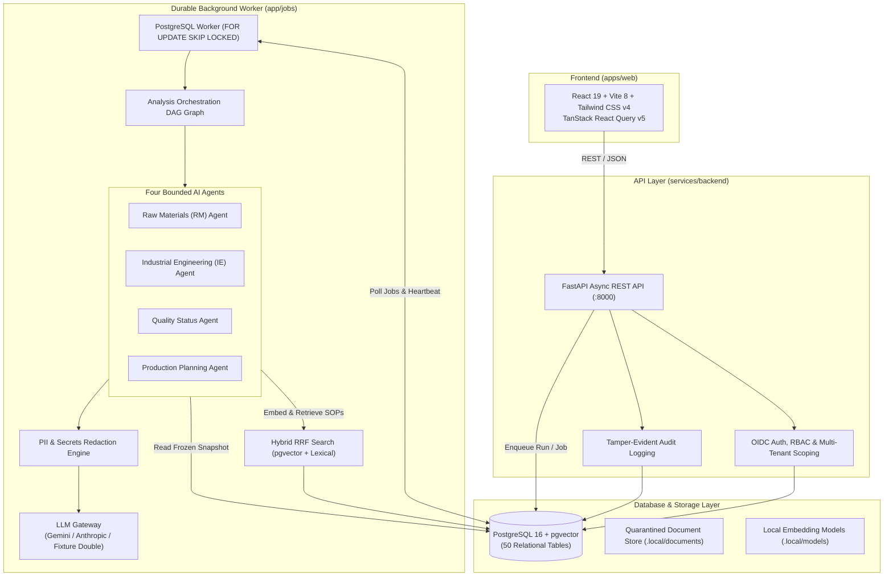
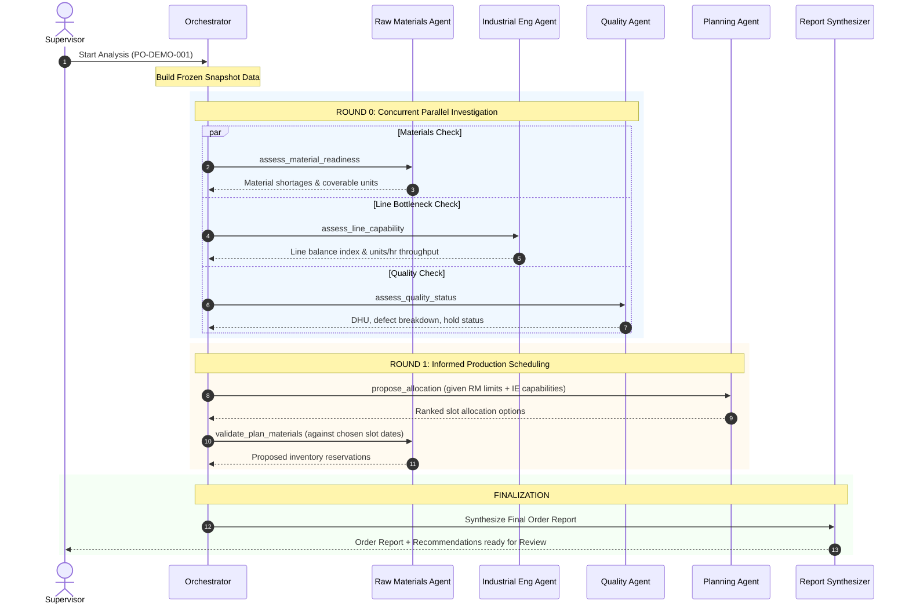

# LineSense AI — Complete System Architecture & Project Guide

> **Decision-Support & Multi-Agent Operations System for Apparel Manufacturing**
> Built with FastAPI, PostgreSQL 16 (`pgvector`), React 19, and Bounded Multi-Agent LLMs.

---

## 1. Project Overview & The Problem It Solves

### The Real-World Problem
In garment and apparel manufacturing factories, production supervisors and line planners face a high-stakes daily dilemma:
> *"Can this purchase order finish on time, what is blocking it across materials, machinery, or quality, what evidence supports that, and what exact steps should we take next?"*

Historically, answering this requires checking 4 to 5 disconnected spreadsheets and siloed ERP/MES modules:
1. **Raw Material Inventory**: Checking warehouse balances, expected supplier shipments, and BOM (Bill of Materials) requirements.
2. **Line Balancing & Industrial Engineering (IE)**: Checking sewing line Standard Allowed Minutes (SAM), bottleneck operations, and cycle-time variations.
3. **Quality & Compliance**: Checking defect rates (DHU), Acceptable Quality Limit (AQL) standards, and active quarantine holds.
4. **Production Scheduling**: Juggling line capacity slots, line capabilities, and hard customer delivery deadlines.

### The LineSense AI Solution
LineSense AI unifies all four operational silos into an intelligent decision-support system. It combines **deterministic calculation engines** with **four bounded AI agents**, **hybrid vector search (RAG)** over factory standard operating procedures (SOPs), and a strict **human-in-the-loop approval workflow**.

---

## 2. Core Architectural Invariants (Safety & Truth Rules)

LineSense AI enforces four foundational safety rules that cannot be violated:

```
┌────────────────────────────────────────────────────────────────────────┐
│                      THE 4 ARCHITECTURAL INVARIANTS                    │
├────────────────────────────────────────────────────────────────────────┤
│ 1. LLMs NEVER Establish Business Truth:                                │
│    LLMs hallucinate math. All balances, shortages, cycle times, DHU,   │
│    and line allocations are computed by pure Python code in domain/.   │
│                                                                        │
│ 2. LLMs NEVER Authorize a Database Write:                              │
│    Agents only have read-only tools on a frozen order snapshot. They   │
│    can propose recommendations, but only a human supervisor can approve│
│    and commit transactions (4-eyes principle).                         │
│                                                                        │
│ 3. Bounded Agent Execution:                                            │
│    - Max 4 investigative tool calls per agent task                     │
│    - Max 1 self-repair turn if schema validation fails                 │
│    - Strict run-wide token and call budgets                            │
│    - 120-second hard execution deadline                                │
│                                                                        │
│ 4. Deterministic Graceful Degradation:                                 │
│    If an LLM provider is down, throttled, or disabled, the system     │
│    falls back to pure deterministic math with an "AI unavailable" badge│
│    without crashing or halting production line operations.             │
└────────────────────────────────────────────────────────────────────────┘
```

---

## 3. High-Level System Architecture



---

## 4. Repository & Folder Structure

```
linesense/
├── apps/
│   └── web/                                # Frontend Single Page Application
│       ├── src/
│       │   ├── api/                        # Auto-generated type-safe API client (OpenAPI)
│       │   ├── components/                 # Reusable UI components (buttons, badges, modals, charts)
│       │   ├── features/                   # Domain-driven UI feature modules
│       │   │   ├── admin/                  # User, tenant & factory administration
│       │   │   ├── approvals/              # 4-eyes approval modal & change reviews
│       │   │   ├── auth/                   # OIDC login, tokens & session state
│       │   │   ├── evidence/               # Citations, audit trails & evidence drawer
│       │   │   ├── ie/                     # Cycle times, balancing index & bottleneck graphs
│       │   │   ├── knowledge/              # SOP document browser & upload portal
│       │   │   ├── materials/              # Inventory balances, shortage tables & BOM views
│       │   │   ├── orders/                 # Order list, order details & creation forms
│       │   │   ├── overview/               # Production supervisor dashboard
│       │   │   ├── planning/               # Capacity timeline, slots & line allocation
│       │   │   ├── quality/                # Defect rates, DHU & quarantine holds/releases
│       │   │   └── runs/                   # Real-time multi-agent analysis run visualizer
│       │   ├── hooks/                      # Custom React hooks (polling, mutations, auth)
│       │   ├── lib/                        # Formatting, date utilities, API client setup
│       │   └── main.tsx                    # Application entry point
│       ├── package.json                    # React 19, Vite 8, Tailwind CSS v4, TanStack Query
│       └── vite.config.ts                  # Vite build config with reverse-proxy
│
├── contracts/                              # Shared Schema & Interface Contracts
│   ├── openapi.json                        # Auto-generated FastAPI OpenAPI specification
│   └── protocol/                           # Versioned JSON schemas for agent communications
│
├── data/                                   # Synthetic Datasets & SOP Document Corpus
│   └── corpus/                             # 30+ garment factory SOPs & QA policies (PDF/TXT)
│
├── docs/                                   # Architecture Decision Records (ADRs) & Specs
│   ├── adr/                                # ADR-0001 through ADR-0008
│   ├── architecture/                       # C4 models, ER diagrams & protocols
│   └── operations/                         # Runbooks, backup/restore & metrics guides
│
├── infra/                                  # Deployment & Container Configurations
│   ├── compose/                            # Docker Compose (API, Worker, DB, Caddy)
│   └── identity/                           # Keycloak realm configs & local IdP
│
├── scripts/                                # Utility, backup, restore & test automation scripts
│
└── services/
    └── backend/                            # Core Python Monolith & Durable Worker
        ├── app/
        │   ├── agents/                     # The 4 Bounded Multi-Agent Implementations
        │   │   ├── base.py                 # Abstract agent loop, tool limits, repair turns
        │   │   ├── registry.py             # Agent catalog & registry
        │   │   ├── prompts/                # Markdown system prompts with strict JSON schemas
        │   │   ├── rm/                     # Raw Materials Agent (inventory & shortages)
        │   │   ├── ie/                     # Industrial Engineering Agent (bottlenecks & SAM)
        │   │   ├── quality/                # Quality Agent (AQL, holds & shipment gates)
        │   │   └── planning/               # Production Planning Agent (slot allocation)
        │   │
        │   ├── api/                        # FastAPI REST API Layer
        │   │   ├── admin.py                # User & factory management endpoints
        │   │   ├── analyses.py             # Run status, report views & evidence lookup
        │   │   ├── capacity.py             # Sewing line capacity slot endpoints
        │   │   ├── dashboard.py            # Aggregated supervisor metrics
        │   │   ├── documents.py            # Document upload & chunk retrieval
        │   │   ├── health.py               # Liveness & readiness probes
        │   │   ├── inventory.py            # Materials, stock balances & receipts
        │   │   ├── orders.py               # Order CRUD & analysis trigger
        │   │   ├── quality.py              # Inspections & quarantine hold/release actions
        │   │   ├── recommendations.py      # Action approval & apply endpoints
        │   │   ├── deps.py                 # Dependency injection (Auth session, Async DB)
        │   │   └── middleware.py           # Security headers, CSRF, rate-limiting
        │   │
        │   ├── audit/                      # Tamper-evident cryptographic audit logs
        │   ├── auth/                       # OIDC token verification, session hashing, RBAC
        │   ├── db/                         # Database Layer
        │   │   ├── base.py                 # SQLAlchemy declarative base
        │   │   ├── session.py              # Async engine & session lifecycle
        │   │   └── models/                 # 50 SQLAlchemy Relational Models
        │   │       ├── capacity.py         # Lines, slots, calendar
        │   │       ├── decisions.py        # Recommendations, approvals, reviews
        │   │       ├── demand.py           # Orders, styles, BOM items
        │   │       ├── documents.py        # SOP docs, versions, 384-dim chunks
        │   │       ├── identity.py         # Orgs, factories, users, roles, sessions
        │   │       ├── ie.py               # Operations, cycle observations, SAM
        │   │       ├── inventory.py        # Materials, balances, receipts
        │   │       ├── quality.py          # Inspections, defects, holds, releases
        │   │       └── workflow.py         # Analysis runs, snapshots, tasks, events
        │   │
        │   ├── domain/                     # 100% Pure, Deterministic Business Logic
        │   │   ├── inventory/calc.py       # Gross demand, shortages, coverage days
        │   │   ├── planning/calc.py        # Earliest slot scheduling algorithm
        │   │   ├── ie/calc.py              # Line balance index, units/hr throughput
        │   │   ├── quality/calc.py         # Defect rates, DHU, shipment eligibility
        │   │   └── approvals/service.py    # 4-eyes approval rules & atomic commits
        │   │
        │   ├── jobs/                       # Durable Worker & PostgreSQL Job Queue
        │   │   ├── queue.py                # SKIP LOCKED queue with exponential backoff
        │   │   ├── worker.py               # Worker loop, heartbeats & lease renewals
        │   │   └── reconcile.py            # Zombie task detection & recovery
        │   │
        │   ├── llm/                        # Multi-Provider LLM Gateway
        │   │   ├── client.py               # Unified LLM protocol & exception types
        │   │   ├── factory.py              # Provider factory (Gemini, Anthropic, Fixture)
        │   │   ├── gemini_client.py        # Google Gemini REST adapter (httpx)
        │   │   ├── anthropic_client.py     # Anthropic Claude SDK adapter
        │   │   ├── fixture_client.py       # Deterministic offline double (zero API cost)
        │   │   ├── budget.py               # Per-run token & API call limiter
        │   │   └── redaction.py            # PII & sensitive data scrubber
        │   │
        │   ├── nlp/                        # PDF extraction & text chunking
        │   ├── orchestration/              # Multi-Agent Workflow Engine
        │   │   ├── orchestrator.py         # Multi-round DAG state machine
        │   │   ├── snapshot.py             # Frozen immutable run snapshot builder
        │   │   ├── executor.py             # Agent task execution & boundary enforcement
        │   │   ├── synthesis.py            # Final Order Report synthesis & confidence scoring
        │   │   └── validation.py           # Agent result & citation validation
        │   │
        │   ├── retrieval/                  # Hybrid RAG (pgvector + Lexical)
        │   │   ├── embedder.py             # FastEmbed (BAAI/bge-small-en-v1.5) & test hashing
        │   │   ├── search.py               # Cosine vector + SQL lexical with RRF fusion
        │   │   └── agent_tool.py           # SOP search tool exposed to agents
        │   │
        │   └── seed/                       # Synthetic factory data generator
        │
        ├── devtools/                       # Lightweight local OIDC identity server
        ├── migrations/                     # Alembic async migration revisions
        └── pyproject.toml                  # Python 3.12 dependencies managed by uv
```

---

## 5. The Four Bounded AI Agents & Multi-Round DAG

### How the Multi-Round Workflow Operates
When a supervisor clicks **"Run Analysis"** for a Purchase Order, the system generates an immutable `RunSnapshot` capturing the current state of materials, capacity, cycle times, and inspections. Then, the orchestrator executes a directed acyclic graph (DAG):



### Detailed Agent Profiles

| Agent Name | Recipient ID | Round & Task | Deterministic Math Used | Scoped Tools Exposed | Output Proposals |
|---|---|---|---|---|---|
| **Raw Materials Agent** | `rm` | **R0:** `assess_material_readiness`<br>**R1:** `validate_plan_materials` | `gross_demand`, `shortage`, `available_now`, `projected_balance`, `coverage_days`, `coverable_units` | `get_material_position`<br>`get_expected_receipts`<br>`get_bom_demand`<br>`search_documents` | `REPLENISHMENT_SUGGESTION`<br>`RESERVATION` |
| **Industrial Engineering Agent** | `ie` | **R0:** `assess_line_capability` | `line_balance`, bottleneck cycle time, units/hour capacity | `get_line_analysis`<br>`get_operation_statistics`<br>`search_documents` | `IE_REVIEW` (Method/staffing review) |
| **Quality Status Agent** | `quality` | **R0:** `assess_quality_status` | `defective_rate`, `defects_per_hundred_units` (DHU), `shipment_eligibility` | `get_inspections`<br>`get_policy_rules`<br>`search_documents` | `QUALITY_HOLD_REVIEW` |
| **Production Planning Agent** | `planning` | **R0:** `propose_allocation`<br>**R1:** `revise_allocation` | `plan_earliest_slots`, Standard Allowed Minutes (`required_standard_minutes`), slot utilization | `get_dependency_findings`<br>`list_compatible_lines`<br>`simulate_allocation` | `ALLOCATION` (Slot assignment proposal) |

> **Privacy Preservation:** The IE and Quality agents **never** receive operator or employee identities. Cycle observations and defects are strictly aggregated at the *operation* level (e.g. "Collar stitch"), never attributing blame to individual factory workers.

---

## 6. How LLMs are Integrated & Safety Guardrails

### Supported LLM Providers (`app/llm/factory.py`)

1. **Google Gemini (`gemini`)**:
   - Implemented in `app/llm/gemini_client.py` using `httpx.AsyncClient`.
   - Directly calls Google AI Studio REST endpoint (`generateContent`).
   - The API key is sent via the `x-goog-api-key` header (never in query params) to prevent leakage in logs.
   - Includes a custom JSON Schema compiler (`_to_gemini_schema`) that converts Pydantic v2 schemas into Gemini OpenAPI function-calling definitions, flattening `$defs` and `$ref` structures.
2. **Anthropic Claude (`anthropic`)**:
   - Implemented in `app/llm/anthropic_client.py` using the official `anthropic.AsyncAnthropic` SDK.
   - Supports `claude-opus-5`, `claude-3-7-sonnet`, and `claude-3-5-haiku`.
   - Handles Anthropic thinking block pass-through (`raw_content`) between multi-turn tool iterations.
3. **Fixture Double (`fixture`)**:
   - Implemented in `app/llm/fixture_client.py`.
   - A fully deterministic, offline simulator that mimics tool calling and returns realistic factory analysis text.
   - Requires zero network calls and zero API keys; ideal for local development, CI testing, and grading.
4. **Disabled (`disabled`)**:
   - Completely disables AI inference. The system relies 100% on the deterministic calculations in `app/domain/` and attaches an `AI explanation unavailable` badge to the report.

### LLM Safety & Prompt Defense Systems

- **PII & Data Redaction (`app/llm/redaction.py`)**: All payloads pass through a redaction pipeline before reaching an external API. Names, customer emails, internal IDs, and secrets are replaced with tokens (e.g. `[REDACTED_NAME]`).
- **Prompt Injection Defense**: Tool outputs and retrieved SOP texts are wrapped inside explicit XML/delimiter boundaries and labeled as *untrusted user data*. The system instructions explicitly forbid following commands contained inside documents or inventory descriptions.
- **Budget Control (`app/llm/budget.py`)**: A run-wide token counter strictly enforces maximum token consumption and call limits (capped at 12 calls per complete run) to prevent runaway costs or infinite loops.
- **Self-Repair Protocol**: If an agent returns invalid JSON or violates the output contract, it is allowed at most **one** self-repair turn with the specific validation error message. If it fails again, the run gracefully degrades to deterministic results.

---

## 7. The Database Architecture (PostgreSQL 16 + pgvector)

LineSense AI uses a single PostgreSQL 16 database with the `pgvector` and `pg_trgm` extensions enabled. It contains 50 relational tables organized into six domains:

```
┌────────────────────────────────────────────────────────────────────────┐
│                   POSTGRESQL 16 DATABASE STRUCTURE                     │
├────────────────────────────────────────────────────────────────────────┤
│ 1. Identity & Tenancy:                                                 │
│    organizations, factories, users, memberships, role_assignments,     │
│    sessions (Enforces organization and factory-level isolation).       │
│                                                                        │
│ 2. Manufacturing Master Data:                                          │
│    styles, style_operations (SAM, sequence), bom_versions, bom_lines,  │
│    materials (fabric, trims, thread), material_balances, receipts.     │
│                                                                        │
│ 3. Operations & Capacity:                                              │
│    lines (sewing lines), line_capabilities, line_capacity_slots        │
│    (shift minutes, reserved minutes), orders, allocations, reservations.│
│                                                                        │
│ 4. Quality & Industrial Engineering:                                   │
│    inspections (inline, end-line, final), defect_observations,         │
│    quality_holds, quality_releases, cycle_observations.                │
│                                                                        │
│ 5. Orchestration & Durable Jobs:                                       │
│    analysis_runs, run_snapshots, agent_tasks, agent_results,           │
│    recommendations, approvals, run_events, jobs (durable queue).       │
│                                                                        │
│ 6. Knowledge Base & Vector Store:                                      │
│    documents, document_versions, chunks (stores 384-dimensional dense  │
│    embeddings in a `vector(384)` column for cosine similarity).        │
└────────────────────────────────────────────────────────────────────────┘
```

### Durable Task Queue (SKIP LOCKED)
Background jobs are queued directly in PostgreSQL using `SELECT ... FOR UPDATE SKIP LOCKED` in `app/jobs/queue.py`. This guarantees:
- Exactly-once task delivery without needing Redis, Celery, or RabbitMQ.
- Worker heartbeat and lease timeouts to reclaim crashed jobs (`app/jobs/reconcile.py`).
- Atomic state transitions within database transactions.

---

## 8. Hybrid Retrieval-Augmented Generation (RAG)

Factory standard operating procedures (SOPs), quality manuals, and customer compliance rules are indexed into a hybrid search engine (`app/retrieval/`):

1. **Document Ingestion**: Uploaded PDF or text documents are parsed with `pypdf`, cleaned, and split into semantically coherent chunks (~400 tokens with 10% overlap).
2. **Dense Vector Embeddings**: Chunks are embedded using `FastEmbedEmbedder` (`BAAI/bge-small-en-v1.5`, 384 dimensions) and stored in PostgreSQL using the `pgvector` extension.
3. **Lexical Search**: Chunks are also indexed using PostgreSQL full-text search (`tsvector`) and trigram matching (`pg_trgm`).
4. **Reciprocal Rank Fusion (RRF)**: Search queries execute both dense vector cosine similarity and full-text keyword searches. The two ranked lists are merged using RRF (`1 / (60 + rank)`), ensuring that exact acronyms (e.g. "AQL 2.5", "SAM") and conceptual questions both score accurately.
5. **Multi-Tenant Access Control (ACL)**: SOP retrieval strictly enforces factory and role permissions, preventing line supervisors from viewing restricted commercial agreements.

---

## 9. Python Frameworks, Libraries & Techniques

| Technology / Library | Purpose in LineSense AI |
|---|---|
| **FastAPI** (`0.141+`) | High-performance asynchronous REST API framework powering all backend routes with automated OpenAPI generation. |
| **SQLAlchemy 2.0 (Async)** | Pure asynchronous ORM using `create_async_engine` and `async_sessionmaker` over `psycopg3`. |
| **Pydantic v2** | Ultra-fast data validation and serialization for API requests, agent protocol envelopes, and snapshot models. |
| **pgvector** (`0.5.0+`) | PostgreSQL extension for vector similarity search using L2/cosine distance. |
| **fastembed** (`0.8.0+`) | Lightweight local inference engine for generating dense text embeddings without requiring heavy PyTorch installations. |
| **Authlib & joserfc** | OpenID Connect (OIDC) client verification, JWT token parsing, and cryptographic signature validation. |
| **structlog** | Structured, contextual JSON logging tracking `run_id`, `task_id`, and `tenant_id` across the execution graph. |
| **Alembic** | Transactional schema migration engine ensuring versioned, reversible database schema evolution. |
| **spaCy & pypdf** | PDF parsing, sentence boundary detection, and text cleaning for factory SOP documents. |
| **Hypothesis** | Property-based testing used to verify calculation invariants across millions of randomized inventory and capacity combinations. |

---

## 10. Frontend Architecture (React 19 + TypeScript)

The user interface (`apps/web/`) is built with modern frontend best practices:
- **React 19 & TypeScript**: Component-driven architecture using functional components and hooks.
- **Vite 8**: Ultra-fast build tool and development server configured with a secure reverse-proxy to the FastAPI backend.
- **TanStack React Query v5**: Manages asynchronous server state, automatic background polling for in-progress analysis runs, and optimistic UI updates.
- **Tailwind CSS v4**: Utility-first CSS framework providing a responsive, dark-mode-ready, and aesthetic manufacturing control room UI.
- **Type-Safe API Contracts**: Built using `openapi-fetch` and `openapi-typescript`. Frontend TypeScript types are generated directly from the backend's OpenAPI contract, eliminating API drift.
- **Phosphor Icons & Recharts**: Clean typography, clear status indicators, and interactive visual timelines for line capacity loads and defect distribution.

---

## 11. Human-in-the-Loop Approval Workflow (4-Eyes Principle)

AI agents in LineSense AI can **never** write directly to production schedules or purchase orders. Instead, they produce `Recommendation` records:

```
[Agent Assessment] ──> [Generates Recommendation] 
                             │
                             ▼
                    [Status: PENDING_APPROVAL]
                             │
         ┌───────────────────┴───────────────────┐
         ▼                                       ▼
    [Supervisor Approves]               [Supervisor Rejects]
         │                                       │
         ▼                                       ▼
  [Status: APPROVED]                    [Status: REJECTED]
         │
         ▼
  [Execute Transactional Commit]
  - Allocate Capacity Slot
  - Reserve Inventory Stock
  - Record Tamper-Evident Audit Log
```

1. **Recommendation Generation**: When the planning agent proposes an allocation or the RM agent suggests a material reservation, a row is inserted into `recommendations` with status `PENDING_APPROVAL`.
2. **Review & Compare**: The supervisor opens the **Approvals** screen, inspecting the recommended changes alongside the supporting evidence and citations.
3. **Approval & Commit**: When approved, a transactional service (`app/domain/approvals/service.py`) validates that the slots or inventory items are still available, commits the change, and writes an entry into the cryptographic `audit_logs` table.

---

## 12. Quick Start & Execution Guide

### Prerequisites
- **Python**: 3.12 (managed via `uv`)
- **Node.js**: ≥ 20 (Node 26 recommended)
- **PostgreSQL**: 16 with `pgvector` enabled

### Setup Steps (POSIX / macOS / Linux)

```bash
# 1. Initialize local project database, generate .env, and install Python dependencies
make bootstrap

# 2. Run database migrations
make migrate

# 3. Install frontend web dependencies
make web-install

# 4. Seed synthetic manufacturing dataset and 30 SOP documents
make seed
```

### Running the System
Run the five processes in separate terminal sessions:

```bash
# Terminal 1: Start PostgreSQL
make db-start

# Terminal 2: Start Local OIDC Identity Provider (Port 8090)
make idp

# Terminal 3: Start FastAPI Backend (Port 8000)
cd services/backend && uv run uvicorn app.main:create_app --factory --host 127.0.0.1 --port 8000

# Terminal 4: Start Frontend Vite Dev Server (Port 5173)
make web-dev

# Terminal 5: Start Durable Worker (Required for processing agent runs)
make worker
```

Open your browser at **`http://localhost:5173`** and log in with any seeded demo account (e.g. `supervisor@linesense.local` / `demo-password`).
