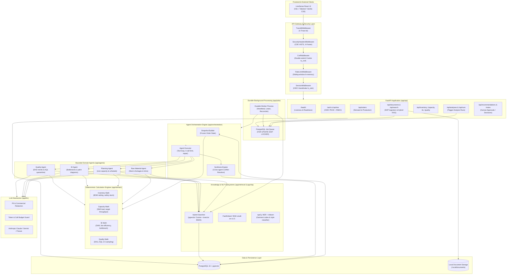
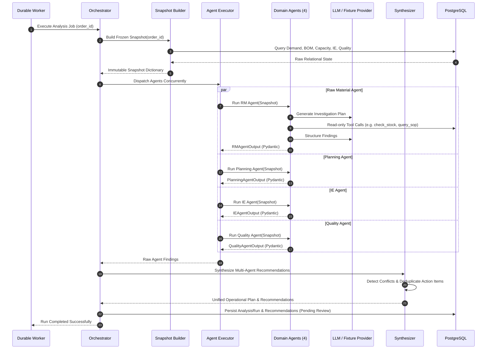

# LineSense AI — Backend Service Guide

> **Production-grade decision-support and multi-agent operations backend for apparel manufacturing.**  
> Built with **FastAPI**, **PostgreSQL 16 (`pgvector`)**, **SQLAlchemy 2.0 (Async)**, **Durable Background Workers**, and **Bounded Multi-Agent LLMs**.

---

## Table of Contents
1. [System Overview & Purpose](#1-system-overview--purpose)
2. [Architectural Invariants (Safety & Ground Truth)](#2-architectural-invariants-safety--ground-truth)
3. [System Architecture Diagram](#3-system-architecture-diagram)
4. [Directory & Package Structure](#4-directory--package-structure)
5. [Core Subsystems & Deep Dive](#5-core-subsystems--deep-dive)
   - [FastAPI HTTP API Layer](#fastapi-http-api-layer)
   - [Durable Job Queue & Worker Engine](#durable-job-queue--worker-engine)
   - [Bounded Multi-Agent Orchestration Framework](#bounded-multi-agent-orchestration-framework)
   - [Deterministic Domain Engines](#deterministic-domain-engines)
   - [Hybrid Retrieval-Augmented Generation (RAG)](#hybrid-retrieval-augmented-generation-rag)
   - [Classical NLP Pipeline](#classical-nlp-pipeline)
   - [Database, Storage & Dual-Role Security](#database-storage--dual-role-security)
   - [Authentication, RBAC & Request Hardening](#authentication-rbac--request-hardening)
   - [LLM Client Abstraction, Redaction & Budgeting](#llm-client-abstraction-redaction--budgeting)
   - [Comprehensive Evaluation Harness](#comprehensive-evaluation-harness)
6. [Configuration & Environment Reference](#6-configuration--environment-reference)
7. [Local Setup & Developer Guide](#7-local-setup--developer-guide)
8. [Testing & Quality Assurance](#8-testing--quality-assurance)

---

## 1. System Overview & Purpose

In garment and apparel manufacturing facilities, line planners and production supervisors manage complex purchase orders (POs) across siloed data sources:
- **Raw Material (RM)**: Fabric roll availability, trim stock, supplier ship dates, and bill-of-materials (BOM) explosion.
- **Capacity Planning**: Sewing line allocations, factory working calendars, shift hours, and target delivery windows.
- **Industrial Engineering (IE)**: Standard Allowed Minutes (SAM), pitch diagrams, operation cycle times, and line balance efficiency.
- **Quality & Compliance**: Defect-per-hundred-units (DHU), Acceptable Quality Limit (AQL 2.5) sampling, and quarantine hold resolution.

**LineSense AI Backend** unifies these disparate operational domains into a coordinated, automated decision-support system. It computes deterministic operational ground truths, coordinates specialized domain AI agents to investigate risks, retrieves relevant factory SOPs via hybrid vector search, and formulates prioritized recommendations for human review and sign-off.

---

## 2. Architectural Invariants (Safety & Ground Truth)

The LineSense AI backend enforces four strict architectural invariants across all agent and API executions:

```
┌────────────────────────────────────────────────────────────────────────┐
│                      THE 4 ARCHITECTURAL INVARIANTS                    │
├────────────────────────────────────────────────────────────────────────┤
│ 1. LLMs NEVER Establish Business Truth:                                │
│    Math, balance netting, shortages, cycle times, DHU rates, and line  │
│    allocations are strictly computed by deterministic Python code in   │
│    app/domain/. LLMs are never permitted to do arithmetic.             │
│                                                                        │
│ 2. LLMs NEVER Authorize Database Writes:                               │
│    Agents execute read-only tools against an immutable snapshot of     │
│    order state. Agents only propose structured recommendations; only   │
│    authorized human operators can commit state changes via approvals.   │
│                                                                        │
│ 3. Bounded Agent Execution:                                            │
│    - Hard ceiling of 4 investigative tool calls per agent run          │
│    - Maximum 1 self-repair retry turn upon schema validation failure   │
│    - Run-wide token budget tracker and 120s wall-clock timeout         │
│                                                                        │
│ 4. Deterministic Graceful Degradation:                                 │
│    If LLM providers fail, throttle, or run offline, the system falls  │
│    back to pure deterministic calculations and rule-based advisories   │
│    with an "AI unavailable" badge without halting line operations.     │
└────────────────────────────────────────────────────────────────────────┘
```

---

## 3. System Architecture Diagram



---

## 4. Directory & Package Structure

```
services/backend/
├── alembic.ini                   # Database migration configuration
├── Dockerfile                    # Multi-stage production container build
├── docker-entrypoint.sh          # Container initialization (migrations + app startup)
├── pyproject.toml                # Dependencies, ruff, mypy, and pytest configs
├── uv.lock                       # Deterministic dependency lockfile
├── migrations/                   # Alembic schema migrations
│   ├── env.py                    # Migration execution environment
│   └── versions/                 # Versioned migration revision scripts
├── tests/                        # Comprehensive test suite (unit, integration, security)
└── app/                          # Core application package
    ├── main.py                   # FastAPI application factory & router registration
    ├── settings.py               # Pydantic BaseSettings (LS_* environment configuration)
    ├── logging.py                # Structured JSON logging setup (structlog)
    │
    ├── api/                      # REST API Endpoints & Middlewares
    │   ├── admin.py              # Operational administration & worker diagnostics
    │   ├── analyses.py           # Analysis runs retrieval & trigger entrypoint
    │   ├── audit.py              # Immutable system audit trail logs
    │   ├── capacity.py           # Sewing line capacity allocations & shift schedules
    │   ├── dashboard.py          # Aggregate operations dashboard metrics
    │   ├── documents.py          # Document upload, ingestion, & chunk inspection
    │   ├── errors.py             # Standardized HTTP error responses
    │   ├── health.py             # Liveness & readiness probes (/health, /health/ready)
    │   ├── ie.py                 # Industrial engineering operations, SAM, & pitch charts
    │   ├── imports.py            # Bulk CSV/Excel data import endpoints
    │   ├── internal.py           # Worker-internal callback & coordination endpoints
    │   ├── inventory.py          # Raw materials, BOM requirements, & stock levels
    │   ├── me.py                 # Current authenticated user profile & permissions
    │   ├── middleware.py         # Trace ID injection & Security headers middleware
    │   ├── notes.py              # Production order collaborative operator notes
    │   ├── notifications.py      # Real-time alert notifications & read acknowledgments
    │   ├── orders.py             # Production orders management & status tracking
    │   ├── quality.py            # Inspection records, DHU rates, & AQL quarantine
    │   ├── ratelimit.py          # Sliding-window rate limiter middleware
    │   ├── recommendations.py    # AI recommendations, overrides, & approval actions
    │   ├── reference.py          # Static reference catalogs (buyers, lines, operations)
    │   ├── runs.py               # Detailed execution traces of analysis runs
    │   ├── search.py             # Hybrid search endpoint (SOPs, orders, documents)
    │   └── summaries.py          # Executive and shift-level summaries
    │
    ├── agents/                   # Bounded Domain AI Agents
    │   ├── base.py               # BaseAgent abstract class, tool protocol, schema validation
    │   ├── registry.py           # Agent registration & discovery catalog
    │   ├── quantities.py         # Standardized unit formatting & safe conversions
    │   ├── ie/                   # Industrial Engineering Agent (bottlenecks, SAM)
    │   ├── planning/             # Capacity Planning Agent (scheduling, line loads)
    │   ├── quality/              # Quality Agent (defects, AQL compliance, quarantine)
    │   ├── rm/                   # Raw Material Agent (stock shortage, BOM netting)
    │   └── prompts/              # System prompts & structured output extraction rules
    │
    ├── orchestration/            # Multi-Agent Coordination & Execution
    │   ├── dispatch.py           # Concurrent agent dispatching logic
    │   ├── events.py             # Internal lifecycle events (started, completed, failed)
    │   ├── executor.py           # Bounded tool-calling execution loop with repair turn
    │   ├── orchestrator.py       # Main pipeline: snapshot -> agents -> synthesize -> persist
    │   ├── protocol.py           # Agent input/output contracts & schema definitions
    │   ├── recommendations.py    # Structured recommendation proposal models
    │   ├── snapshot.py           # Frozen immutable database snapshot generator
    │   ├── synthesis.py          # Conflict detection & unified action plan synthesis
    │   └── validation.py         # Strict Pydantic output validation & enforcement
    │
    ├── domain/                   # Deterministic Calculation Engines (Pure Business Logic)
    │   ├── clock.py              # Timezone-aware factory clock abstraction
    │   ├── rounding.py           # Production unit & currency rounding utilities
    │   ├── vocab.py              # Canonical apparel terminology & status constants
    │   ├── approvals/            # Human-in-the-loop decision state machine
    │   ├── capacity/             # Line loading, daily target output, shift hours math
    │   ├── ie/                   # Pitch balance, theoretical vs actual efficiency, bottleneck
    │   ├── inventory/            # BOM explosion, available-to-promise, shortage netting
    │   ├── orders/               # Purchase order lifecycle & fulfillment calculations
    │   ├── planning/             # Schedule constraint solver & milestone tracking
    │   └── quality/              # DHU calculation, AQL-2.5 sampling plan evaluation
    │
    ├── jobs/                     # Durable Background Queue & Worker System
    │   ├── __main__.py           # CLI entrypoint for background worker process
    │   ├── handlers.py           # Job type dispatchers (analysis_run, document_ingest)
    │   ├── queue.py              # PostgreSQL SKIP LOCKED transactional queue
    │   ├── reconcile.py          # Automatic dead worker detection & stale job recovery
    │   └── worker.py             # Event loop, heartbeats, cooperative shutdown
    │
    ├── retrieval/                # Knowledge Base & Hybrid RAG System
    │   ├── agent_tool.py         # Read-only SOP search tool exposed to agents
    │   ├── chunking.py           # Semantic paragraph & table chunking for PDFs
    │   ├── embedder.py           # FastEmbed wrapper (BAAI/bge-small-en-v1.5)
    │   ├── extract.py            # PyPDF text & metadata extraction
    │   ├── loader.py             # File storage & document ingestion pipeline
    │   ├── pipeline.py           # End-to-end ingestion, chunking, and vector indexing
    │   ├── search.py             # Hybrid search (Dense vector + PostgreSQL BM25 FTS)
    │   └── storage.py            # Local document filesystem backend
    │
    ├── nlp/                      # Classical NLP & Document Classification
    │   ├── classifier.py         # scikit-learn TF-IDF document categorization
    │   ├── entities.py           # spaCy rule & model based apparel entity recognition
    │   └── summarize.py          # Deterministic extractive text summarization
    │
    ├── auth/                     # Authentication & Authorization Subsystem
    │   ├── csrf.py               # Cryptographic double-submit CSRF cookie validator
    │   ├── oidc.py               # Authlib OpenID Connect / OAuth2 client with PKCE
    │   ├── policy.py             # Fine-grained role policies & authorization gates
    │   ├── routes.py             # Auth endpoints (/auth/login, /auth/callback, /auth/logout)
    │   ├── scope.py              # Permission scopes & resource boundaries
    │   └── sessions.py           # Server-side opaque session token store (ls_session)
    │
    ├── db/                       # Database Session & Data Modeling
    │   ├── base.py               # Declarative SQLAlchemy Base class
    │   ├── session.py            # Async engine, connection pool, & session maker
    │   ├── types.py              # Custom SQLAlchemy types (UUID, JSONB, Vector)
    │   └── models/               # Domain-specific relational models
    │       ├── capacity.py       # Lines, shifts, capacity allocations
    │       ├── decisions.py      # Recommendations, approvals, user overrides
    │       ├── demand.py         # Orders, buyer POs, style revisions
    │       ├── documents.py      # Documents, document chunks, embedding vectors
    │       ├── identity.py       # Users, roles, active user sessions
    │       ├── ie.py             # Standard operations, machine types, SAM pitches
    │       ├── inventory.py      # Items, warehouse lots, BOM components, allocations
    │       ├── operations.py     # Real-time line progress & tracking counts
    │       ├── quality.py        # Inspection checkpoints, defect logs, AQL audits
    │       └── workflow.py       # Background jobs, analysis runs, agent execution logs
    │
    ├── llm/                      # LLM Abstraction, Security & Budgeting
    │   ├── client.py             # Abstract LLM client protocol
    │   ├── factory.py            # Provider selection factory (anthropic/gemini/fixture)
    │   ├── anthropic_client.py   # Claude 3.5 Sonnet / Opus API integration
    │   ├── gemini_client.py      # Gemini 2.0 Flash API integration
    │   ├── fixture_client.py     # Deterministic mock client for testing & offline mode
    │   ├── budget.py             # Run-level token budget enforcement
    │   └── redaction.py          # Regex & heuristic PII / supplier price scrubbers
    │
    ├── audit/                    # Compliance & Traceability
    │   └── ledger.py             # Immutable audit event writer
    │
    ├── idempotency/              # Distributed Action Idempotency
    │   └── keys.py               # Idempotency token generation & replay prevention
    │
    ├── seed/                     # Development & Demonstration Data
    │   ├── demo_data.py          # Realistic factory seed generator (apparel styles, lines)
    │   └── sops/                 # Synthetic manufacturing Standard Operating Procedures
    │
    └── evaluation/               # Comprehensive Evaluation & Benchmarking Suite
        ├── __main__.py           # CLI entrypoint for evaluation runner
        ├── agent_eval.py         # Multi-agent behavioral evaluation & tool validation
        ├── calc_eval.py          # Deterministic math engine accuracy benchmarks
        ├── fairness_eval.py      # Recommendation bias & operational fairness evaluation
        ├── metrics.py            # Metric aggregators (MRR, latency, faithfulness)
        ├── nlp_eval.py           # Entity extraction & classification precision/recall
        ├── report.py             # Markdown & JSON evaluation report generator
        ├── retrieval_eval.py     # Hybrid search RAG accuracy (Recall@K, MRR@K)
        └── security_eval.py      # Prompt injection, data leakage, & safety tests
```

---

## 5. Core Subsystems & Deep Dive

### FastAPI HTTP API Layer
- **Factory Pattern**: Initialized in `app/main.py:create_app()` with modular routers.
- **Middleware Chain (Ordered Outermost to Innermost)**:
  1. `TraceIdMiddleware`: Extracts or generates an `X-Trace-Id` UUID, binding it to the request context and `structlog` logger.
  2. `SecurityHeadersMiddleware`: Sets strict Content Security Policy (CSP), `X-Content-Type-Options: nosniff`, `X-Frame-Options: DENY`, and HTTP Strict Transport Security (HSTS in production).
  3. `SessionMiddleware`: Manages short-lived signed cookies (`ls_oidc`, 10-minute expiry) strictly for the OIDC OAuth handshake state and PKCE verifier.
  4. `CsrfMiddleware`: Enforces double-submit CSRF tokens (`ls_csrf`) on state-modifying requests (`POST`, `PUT`, `DELETE`, `PATCH`).
  5. `RateLimitMiddleware`: In-memory sliding-window limiter (default: 120 requests/minute per IP/session) with standard `429 Too Many Requests` responses.
- **Error Handling**: Standardized RFC-7807 problem details format managed via `app.api.errors:register_exception_handlers()`.

### Durable Job Queue & Worker Engine
Background tasks such as deep order analysis runs and document RAG indexing are executed asynchronously to keep HTTP response times low and guarantee execution resilience.

- **PostgreSQL SKIP LOCKED Queue**: Implemented in `app/jobs/queue.py`. Workers poll using:
  ```sql
  SELECT * FROM jobs 
  WHERE status = 'pending' AND run_at <= NOW()
  ORDER BY priority DESC, id ASC 
  FOR UPDATE SKIP LOCKED 
  LIMIT 1;
  ```
  This eliminates lock contention between multiple worker processes without requiring Redis or Celery.
- **Leases & Heartbeats**: When a worker takes a job, it acquires a lease. A background task continuously pings the job record.
- **Dead Worker Reconciler (`app/jobs/reconcile.py`)**: Automatically scans for orphaned jobs whose leases have expired (e.g., worker container crashed), re-queuing them with exponential backoff up to the retry limit.
- **Worker Daemon Entrypoint**: Run via `python -m app.jobs` (or `make worker`).

### Bounded Multi-Agent Orchestration Framework
The orchestration system (`app/orchestration/`) manages the execution of four domain agents to analyze purchase orders:



#### Guardrails & Bounded Execution:
1. **Tool Budget**: An agent can make a maximum of **4 investigative tool calls** per execution run.
2. **Self-Repair Loop**: If an agent generates output that fails Pydantic schema validation, it is given **exactly 1 repair turn** with the explicit validation error before falling back to rule-based defaults.
3. **Run Deadline**: Hard cancellation after 120 seconds.
4. **Token Budget**: Tracked at the analysis run level; aborts if consumption exceeds defined quotas.

### Deterministic Domain Engines
Located in `app/domain/`, these pure Python modules establish mathematical operational facts:
- **Inventory (`app/domain/inventory/`)**:
  - Explodes the Bill of Materials (BOM) against purchase order colorways and sizes.
  - Computes allocated stock, available-to-promise (ATP), safety-stock buffers, and net shortages.
- **Capacity Planning (`app/domain/capacity/`)**:
  - Calculates line throughput based on sewing operator count, standard working hours, and efficiency curves.
  - Predicts finish dates against factory master calendars and planned line changeovers.
- **Industrial Engineering (`app/domain/ie/`)**:
  - Compiles operation bulletins and calculates Standard Allowed Minutes (SAM).
  - Identifies bottleneck operations where cycle time exceeds takt time.
  - Computes pitch diagram balance efficiency:  
    $$\text{Balance Efficiency} = \frac{\sum \text{Operation Times}}{\text{Number of Stations} \times \text{Bottleneck Time}} \times 100\%$$
- **Quality (`app/domain/quality/`)**:
  - Calculates Defects Per Hundred Units (DHU):  
    $$\text{DHU} = \frac{\text{Total Defects Found}}{\text{Total Garments Inspected}} \times 100$$
  - Evaluates Acceptable Quality Limit (AQL 2.5) normal/tightened sampling tables to flag batch rejection risk.
- **Approvals (`app/domain/approvals/`)**:
  - Enforces the **four-eyes principle** state machine: Recommendations start as `PROPOSED`, require user review to become `APPROVED` or `REJECTED`, and cannot be auto-committed by AI agents.

### Hybrid Retrieval-Augmented Generation (RAG)
Located in `app/retrieval/`, this system indexes factory standard operating procedures (SOPs), technical manuals, and buyer compliance guidelines.
- **Document Chunking (`chunking.py`)**: Parses PDFs and markdown documents into semantically coherent chunks with sliding windows and table-structure preservation.
- **Embedding Generation (`embedder.py`)**: Uses `fastembed` with `BAAI/bge-small-en-v1.5` (384 dimensions) running locally on CPU.
- **Hybrid Search Algorithm (`search.py`)**:
  - **Dense Vector Search**: Cosine distance using PostgreSQL `pgvector` (`<=>` operator).
  - **Sparse Full-Text Search**: PostgreSQL `tsvector` with `websearch_to_tsquery` English stemming.
  - **Reciprocal Rank Fusion (RRF)**: Merges dense and sparse ranks to ensure both exact keyword hits (e.g., fabric code "TC-65-35") and semantic matches are surfaced.
- **Agent Integration (`agent_tool.py`)**: Exposes a read-only `query_sop_knowledge_base` tool to domain agents.

### Classical NLP Pipeline
Located in `app/nlp/`:
- **Named Entity Recognition (`entities.py`)**: spaCy-based pipeline extracting garment styles, colorways, fabric blends, and trim specifications from free-text order notes.
- **Document Classifier (`classifier.py`)**: scikit-learn TF-IDF + Logistic Regression model that classifies incoming factory documents (e.g., "Buyer Tech Pack", "Material Test Report", "Audit Compliance", "SOP").
- **Extractive Summarizer (`summarize.py`)**: Deterministic text-rank / sentence scoring for generating concise order briefs.

### Database, Storage & Dual-Role Security
- **PostgreSQL 16 + pgvector**: Stores operational transactions, time-series line tracking, and vector embeddings.
- **SQLAlchemy 2.0 Async**: Fully asynchronous database communication using `psycopg` (v3).
- **Dual Database Role Model**:
  - `linesense_owner`: High-privilege role used **strictly for Alembic schema migrations and table creation**.
  - `linesense_app`: Restricted least-privilege role used by the **runtime web API and background workers** (granted only `SELECT`, `INSERT`, `UPDATE`, `DELETE` on application tables).

### Authentication, RBAC & Request Hardening
Located in `app/auth/`:
- **OIDC Provider Integration**: Standard OAuth2 / OpenID Connect authorization code flow with **PKCE** (Proof Key for Code Exchange) supporting Google, Auth0, Keycloak, or the built-in development IdP.
- **Opaque Server-Side Sessions**: Active user sessions are stored in the database (`ls_session` table) with high-entropy cryptographic tokens.
- **Role-Based Access Control (RBAC)**:
  - `operator`: View line progress, record manual inspection counts, view approved recommendations.
  - `planner`: Manage order schedules, configure line capacities, view analysis results.
  - `supervisor`: Review AI recommendations, approve/reject operational decisions, trigger ad-hoc analysis runs.
  - `admin`: User management, system configuration, audit log inspection, worker status diagnostics.

### LLM Client Abstraction, Redaction & Budgeting
Located in `app/llm/`:
- **Provider Agnostic**: Switchable via `LS_LLM_PROVIDER`:
  - `anthropic`: Anthropic Claude API (`claude-3-5-sonnet`, `claude-opus-5`).
  - `gemini`: Google Gemini API (`gemini-2.5-flash`).
  - `fixture`: Deterministic mock provider replaying canned responses for offline development and CI/CD pipelines.
  - `disabled`: Shuts off external LLM calls, activating deterministic fallback heuristics.
- **Redaction Engine (`redaction.py`)**: Scrubs PII, email addresses, credit cards, and sensitive financial terms before any prompt payload is transmitted over the wire.
- **Token Budget Guard (`budget.py`)**: Tracks prompt and completion tokens per run; halts agent loops if cost bounds are exceeded.

### Comprehensive Evaluation Harness
Located in `app/evaluation/`:
- Run via `python -m app.evaluation` (or `make eval`).
- Tests system quality across 6 key pillars:
  1. `calc_eval.py`: Verifies deterministic math calculation accuracy (BOM netting, SAM balance, DHU).
  2. `agent_eval.py`: Measures multi-agent decision quality and schema compliance across benchmark scenarios.
  3. `fairness_eval.py`: Checks for line-scheduling bias and operator allocation fairness.
  4. `nlp_eval.py`: Benchmarks NER entity extraction and document classification precision/recall.
  5. `retrieval_eval.py`: Evaluates hybrid RAG retrieval accuracy using Mean Reciprocal Rank (MRR) and Recall@K.
  6. `security_eval.py`: Tests prompt injection resistance, system prompt leakage, and PII redaction efficacy.

---

## 6. Configuration & Environment Reference

All settings are configured via environment variables prefixed with `LS_` (defined in `app/settings.py`):

| Variable | Type | Default | Description |
|---|---|---|---|
| `LS_ENVIRONMENT` | String | `development` | Environment mode (`development`, `test`, `production`). |
| `LS_DATABASE_URL` | String | `postgresql+psycopg://.../linesense_dev` | Async connection string for runtime app user (`linesense_app`). |
| `LS_MIGRATION_DATABASE_URL` | String | `postgresql+psycopg://.../linesense_dev` | Async connection string for migration owner (`linesense_owner`). |
| `LS_SESSION_SECRET` | Secret | `dev-session-secret...` | Cryptographic secret for signing OIDC handshake cookies. |
| `LS_SERVICE_TOKEN` | Secret | `dev-service-token...` | Shared secret for internal service-to-service communication. |
| `LS_PUBLIC_ORIGIN` | String | `http://localhost:5173` | Frontend URL allowed for CORS and redirection targets. |
| `LS_API_INTERNAL_URL` | String | `http://127.0.0.1:8000` | Local loopback address for internal worker callbacks. |
| `LS_OIDC_ISSUER` | String | `http://127.0.0.1:8090` | OpenID Connect discovery issuer URL. |
| `LS_OIDC_CLIENT_ID` | String | `linesense-web` | Client ID registered with the OIDC identity provider. |
| `LS_OIDC_CLIENT_SECRET` | Secret | `dev-oidc-client-secret` | Client secret registered with the OIDC identity provider. |
| `LS_OIDC_REDIRECT_URI` | String | `http://localhost:5173/auth/callback` | Callback URL registered for the OAuth handshake. |
| `LS_LLM_PROVIDER` | String | `fixture` | LLM driver: `anthropic`, `gemini`, `fixture`, or `disabled`. |
| `LS_ANTHROPIC_API_KEY` | Secret | `""` | Anthropic API key (required if `LS_LLM_PROVIDER=anthropic`). |
| `LS_ANTHROPIC_MODEL` | String | `claude-opus-5` | Model name for Anthropic agent calls. |
| `LS_GEMINI_API_KEY` | Secret | `""` | Google Gemini API key (required if `LS_LLM_PROVIDER=gemini`). |
| `LS_GEMINI_MODEL` | String | `gemini-2.5-flash` | Model name for Gemini agent calls. |
| `LS_DOCUMENT_STORAGE_DIR`| String | `../../.local/documents` | Directory where uploaded PDF tech packs and SOPs are stored. |
| `LS_EMBEDDING_MODEL` | String | `BAAI/bge-small-en-v1.5` | HuggingFace embedding model ID for fastembed. |
| `LS_RUN_DEADLINE_SECONDS`| Integer| `120` | Maximum execution time before an analysis run is cancelled. |
| `LS_MAX_UPLOAD_BYTES` | Integer| `10485760` (10 MB) | Maximum permitted file upload size for documents and tech packs. |

---

## 7. Local Setup & Developer Guide

### Prerequisites
- **Python**: Version `3.12`
- **Package Manager**: [`uv`](https://github.com/astral-sh/uv) (recommended) or standard `pip`
- **Database**: PostgreSQL 16 with the `pgvector` extension enabled

### Step-by-Step Setup

1. **Navigate to the Backend Directory**:
   ```bash
   cd services/backend
   ```

2. **Create Virtual Environment & Install Dependencies**:
   ```bash
   # Using uv (fastest)
   uv venv --python 3.12
   uv sync --all-groups
   ```

3. **Configure Environment Variables**:
   Copy `.env.example` from the repository root:
   ```bash
   cp ../../.env.example ../../.env
   ```
   Ensure PostgreSQL credentials in `.env` match your local database instance.

4. **Apply Database Migrations**:
   Run Alembic to create all schema tables, vector extensions, and indexes:
   ```bash
   uv run alembic upgrade head
   ```

5. **Seed Demonstration Data (Optional)**:
   Populate the database with realistic apparel styles, lines, inventory lots, and SOPs:
   ```bash
   uv run python -m app.seed.demo_data
   ```

6. **Start the FastAPI Web Server**:
   ```bash
   uv run uvicorn app.main:create_app --factory --host 0.0.0.0 --port 8000 --reload
   ```
   The interactive OpenAPI documentation will be accessible at:  
   👉 `http://localhost:8000/docs`

7. **Start the Background Worker Daemon**:
   In a separate terminal, launch the durable worker to process queued jobs:
   ```bash
   uv run python -m app.jobs
   ```

---

## 8. Testing & Quality Assurance

The backend includes a comprehensive automated test suite covering unit math, database integration, agent bounds, and security hardening.

```bash
# Run all unit tests
uv run pytest tests/ -m "not integration and not security"

# Run integration tests against real PostgreSQL instance
uv run pytest tests/ -m "integration"

# Run security, authentication, and penetration tests
uv run pytest tests/ -m "security"

# Run type checker (strict mode)
uv run mypy app

# Run linter and formatting checks
uv run ruff check app tests
uv run ruff format --check app tests

# Run the complete system evaluation benchmark suite
uv run python -m app.evaluation
```
